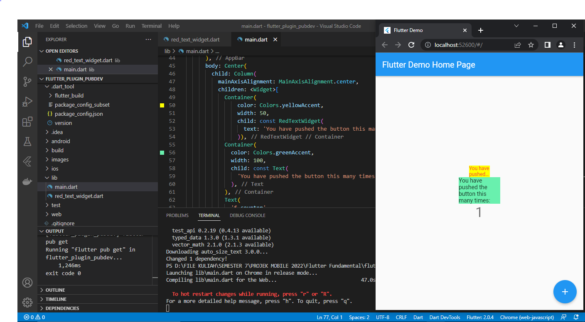

# Praktikum Menerapkan Plugin di Project Flutter

### 1. Membuat Project Baru

### 2. Menambahkan Plugin
Menambahkan plugin auto_size_text dengan menggunakan perintah berikut :

Jika berhasil maka akan tampil nama plugin di pubspec.yaml

### 3. Membuat file red_text_widget.dart
Membuat file red_text_widget pada folder lib

### 4. Menambahkan Widget AutoSizeText pada file red_text_widget.dart
Maka akan terjadi error dikarenakan belum melakukan import pada package import 'package:auto_size_text/auto_size_text.dart';

### 5. Membuat Variabel text dan parameter di constructor
Membuat variabel text dan parameter diconstructor di file red_text_widget.dart
 

### 6. Menambahkan widget di main.dart
Menambahkan widget di main.dart dengan kode seperti berikut
 

### 7. Melakukan Run aplikasi tersebut, maka hasilnya akan seperti berikut.
 

### Pertanyaan No 2 => Jelaskan maksud dari langkah 2 pada praktikum tersebut! 
Untuk melakukan instalasi package dan menambahkan plugin ke projek 

### Pertanyaan No 3 => Jelaskan maksud dari langkah 5 pada praktikum tersebut!
Untuk menambahkan variabel dan parameter constructor

### Pertanyaan No 4 => Pada langkah 6 terdapat dua widget yang ditambahkan, jelaskan fungsi dan perbedaannya!
Pada container yang pertama menggunakan warna background yellowAccent dengan lebar 50 yang menggunakan constructor dari class RedTextWidget dengan menggunakan autosizetext dengan textstyle Colors.Red dan fontsize:14 dengan max lines 2

Pada container yang kedua menggunakan warna background greenAccent dengan lebar 100 yang menggunakan Text  biasa tanpa menggunakan autosizetext pada class RedTextWidget

### Pertanyaan No 5 => Jelaskan maksud dari tiap parameter yang ada di dalam plugin auto_size_text berdasarkan tautan pada dokumentasi ini !

Max Lines = Jumlah maksimum baris opsional untuk teks yang akan dibentangkan
minFontSize = Batasan ukuran teks minimum yang akan digunakan saat mengubah ukuran teks secara otomatis.
maxFontSize = Batasan ukuran teks maksimum yang akan digunakan saat mengubah ukuran teks secara otomatis.
stepGranularity = Ukuran langkah di mana ukuran font sedang disesuaikan dengan batasan.
maxLines = Jumlah maksimum baris opsional untuk teks yang akan dibentangkan.
overflowReplacement = 	Jika teks meluap dan tidak sesuai dengan batasnya, widget ini akan ditampilkan sebagai gantinya.

